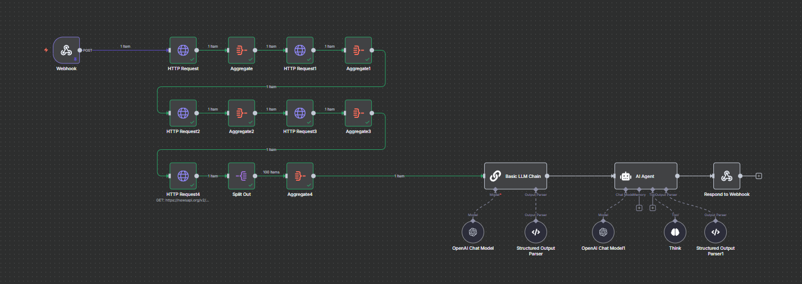

# CryptoTrader Pro

## Project Info

**Description**:  
CryptoTrader Pro provides users with detailed cryptocurrency trading insights, including short-term and long-term trends, price analysis, and other essential data to help traders make informed decisions. Users can input a cryptocurrency name to get these details instantly.  

The backend is powered by **n8n**, which handles data fetching, analysis, and generates responses that are sent to the front end.

**URL**: 

---

## Architecture Overview

  

1. **Frontend**: React-based interface where users input crypto names.  
2. **Backend**: n8n workflow that fetches market data, performs analysis, and sends results to the frontend.  
3. **Data Flow**: Users → Frontend → n8n Backend → Processed Insights → Frontend Display.

---

## How to Edit This Code

You can edit this project locally using your preferred IDE. Ensure you have Node.js and npm installed.  

### Steps to Run Locally

```sh
# Step 1: Clone the repository
git clone https://github.com/RashmithaDeSilva/CryptoTrader_Pro.git

# Step 2: Navigate to the project directory
cd CryptoTrader_Pro

# Step 3: Install dependencies
npm install

# Step 4: Start the development server
npm run dev
```

### Technologies Used

- Frontend:

    - Vite

    - TypeScript

    - React

    - shadcn-ui

    - Tailwind CSS

- Backend:

    - n8n (for workflow automation, data fetching, and analysis)